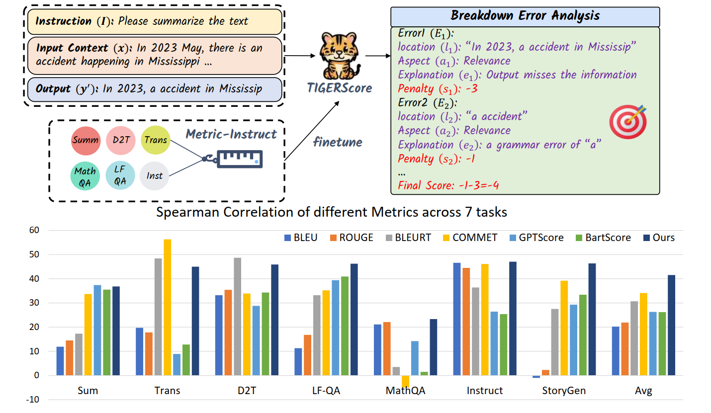

# **TIGERScore**
This repo contains the code, data, and models for "[TIGERScore: Towards Building Explainable Metric for All Text Generation Tasks](https://arxiv.org/abs/2310.00752)"


<div align="center">
 🔥 🔥 🔥 Check out our <a href = "https://tiger-ai-lab.github.io/TIGERScore/">[Project Page]</a> for more results and analysis!
</div>

<br>
<div align="center">
  
</div>

### Datasets and Models
Our dataset and models are all available at Huggingface.

🤗 [MetricInstruct Dataset](https://huggingface.co/datasets/TIGER-Lab/MetricInstruct)

|     	| Base Model: Llama-2                                           	 | 
|-----	|---------------------------------------------------------------	 |
| 7B  	|  [TIGERScore-7B-V1.0](https://huggingface.co/TIGER-Lab/TIGERScore-7B-V1.0)   	| 
| 13B 	|  [TIGERScore-13B-V1.0](https://huggingface.co/TIGER-Lab/TIGERScore-7B-V1.0) 	| 


## **Table of Contents**

- [📌 Introduction](#introduction)
- [⚙️ Installation](#installation)
- [🛠️ Training and Inference](#training-and-inference)
- [📜 License](#license)
- [📖 Citation](#citation)

## **Introduction**
We present 🐯 TIGERScore, a **T**rained metric that follows **I**nstruction **G**uidance to perform **E**xplainable, and **R**eference-free evaluation over a wide spectrum of text generation tasks. Different from other automatic evaluation methods that only provide arcane scores, TIGERScore is guided by the natural language instruction to provide error analysis to pinpoint the mistakes in the generated text.
## **Installation**

Clone this repository and install the required packages:

```bash
git clone https://github.com/TIGER-AI-Lab/TIGERSCORE.git
cd TIGERSCORE
pip install -r requirements.txt
```

## **Training and Inference**

### **Data Loading**

Run the following command to preprocess the data:

```python
from datasets import load_dataset

dataset = load_dataset("TIGER-Lab/MetricInstruct")
```

### **Quick Start**
WIP
<!-- To play with our model, run:

```python
from transformers import pipeline
pipeline = pipeline("text-generation", "TIGER-Lab/MAmmoTH-Coder-7B")

alpaca_template = "Below is an instruction that describes a task. Write a response that appropriately completes the request.\n### Instruction:\n{query}\n\n### Response:"

query = "Janet's ducks lay 16 eggs per day. She eats three for breakfast every morning and bakes muffins for her friends every day with four. She sells the remainder at the farmers' market daily for $2 per fresh duck egg. How much in dollars does she make every day at the farmers' market?"

### By default, MAmmoTH will output the Chain-of-thought (CoT) rationale
rationale_prefix = ""

### You can let MAmmoTH output Program-of-thought (PoT) rationale by simply adding
rationale_prefix = " Let's write a program."

input = alpaca_template.format(query = query + rationale_prefix)

output = pipeline(input)[0]['generated_text']
print(output)
``` -->

### **Large-scale Evaluation**
WIP
<!-- To replicate the experimental results in our paper, run:

```bash
### For open-eneded questions, the dataset should be one of 
### ['gsm8k', 'svamp', 'math', 'numglue', 'deepmind', 'simuleq'] 
### We use PoT for open-eneded questions and set --stem_flan_type "pot_prompt"

dataset='math'

python run_open.py \
  --model "TIGER-Lab/MAmmoTH-Coder-7B" \
  --shots 0 \
  --stem_flan_type "pot_prompt" \
  --batch_size 8 \
  --dataset $dataset \
  --model_max_length 1500 \
  --cot_backup \
  --print
```

```bash
### For mutilple-choice questions, the dataset should be one of 
### ['aqua', 'sat', 'mmlu_mathematics'].
### We use CoT for mutilple-choice questions and set --stem_flan_type ""
dataset='aqua'

python run_choice.py \
  --model "TIGER-Lab/MAmmoTH-Coder-7B" \
  --shots 0 \
  --match_answer "self"
  --stem_flan_type "" \
  --batch_size 8 \
  --dataset $dataset \
  --print
``` -->

### **Fine-tuning**

WIP

<!-- To train the 7B/13B model, run:

```bash
torchrun --nproc_per_node [$WORKER_GPU] \
 --master_addr [$WORKER_0_HOST] \
 --node_rank [$ROLE_INDEX] \
 --master_port [$WORKER_0_PORT] \
 --nnodes [$WORKER_NUM] \
train.py \
    --model_name_or_path "codellama/CodeLlama-7b-hf" \
    --data_path "TIGER-Lab/MathInstruct" \
    --bf16 True \
    --output_dir checkpoints/MAmmoTH-Coder-7B \
    --num_train_epochs 3 \
    --per_device_train_batch_size 2 \
    --per_device_eval_batch_size 1 \
    --gradient_accumulation_steps 8 \
    --evaluation_strategy "no" \
    --save_strategy "steps" \
    --save_steps 2000\
    --save_total_limit 1 \
    --learning_rate 2e-5 \
    --weight_decay 0. \
    --warmup_ratio 0.03 \
    --lr_scheduler_type "cosine" \
    --logging_steps 1 \
    --fsdp "full_shard auto_wrap" \
    --fsdp_transformer_layer_cls_to_wrap 'LlamaDecoderLayer' \
    --tf32 True
``` -->


## **License**
WIP
<!-- Please check out the license of each subset in our curated dataset MathInstruct.
| Dataset Name 	| License Type   	|
|--------------	|----------------	|
| GSM8K        	| MIT            	|
| GSM8K-RFT    	| Non listed      |
| AQuA-RAT     	| Apache 2.0     	|
| MATH         	| MIT            	|
| TheoremQA    	| MIT            	|
| Camel-Math   	| Attribution-NonCommercial 4.0 International    	|
| NumGLUE      	| Apache-2.0          	|
| CrowdSourced (Lila)	| Attribution 4.0 International     	|
| MathQA       	| Apache-2.0     	|
| Our Curated   | MIT             | -->


## **Citation**

Please cite our paper if you use our data, model or code. Please also kindly cite the original dataset papers. 

```
@article{jiang2023TIGERScore,
  title={TIGERScore: Towards Building Explainable Metric for All Text Generation Tasks},
  author={Dongfu Jiang, Yishan Li, Ge Zhang, Wenhao Huang, Bill Yuchen Lin, Wenhu Chen},
  journal={arXiv preprint arXiv:2310.00752},
  year={2023}
}
```
